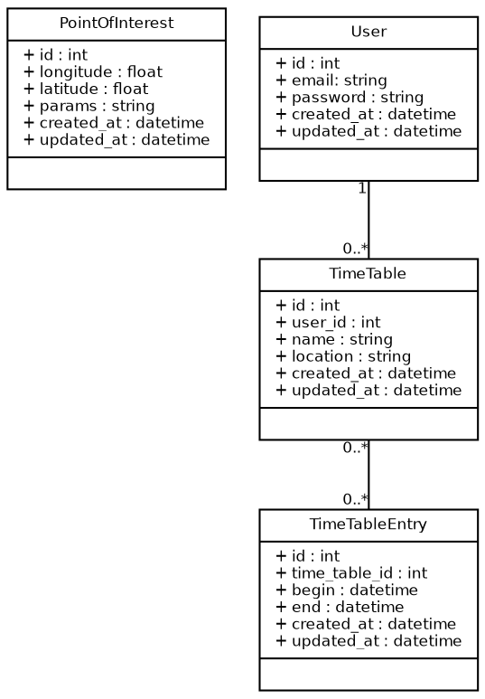

```graphviz
digraph G {
        fontname = "Bitstream Vera Sans"
        fontsize = 8

        node [
                fontname = "Bitstream Vera Sans"
                fontsize = 8
                shape = "record"
        ]

        edge [
                fontname = "Bitstream Vera Sans"
                fontsize = 8
        ]

        PointOfInterest [
                label = "{PointOfInterest|+ id : int\l+ longitude : float\l+ latitude : float
                            \l+ params : string\l+ created_at : datetime\l+ updated_at : datetime\l
                            | \l}"
        ]

        TimeTable [
                label = "{TimeTable|+ id : int\l+ user_id : int\l+ name : string
                            \l+ location : string\l+ created_at : datetime\l+ updated_at : datetime\l
                            | \l}"
        ]

        TimeTableEntry [
                label = "{TimeTableEntry|+ id : int\l+ time_table_id : int\l+ begin : datetime
                            \l+ end : datetime\l+ created_at : datetime\l+ updated_at : datetime\l
                            | \l}"
        ]

        User [
                label = "{User|+ id : int\l+ email: string\l+ password : string 
                            \l+ created_at : datetime\l+ updated_at : datetime\l
                            | \l}"
        ]

        edge [
                arrowhead = "none"

                headlabel = "0..*"
                taillabel = "0..*"
        ]

        TimeTable -> TimeTableEntry 

        edge [
                arrowhead = "none"

                headlabel = "0..*"
                taillabel = "1"
        ]
        User -> TimeTable 
}
```
