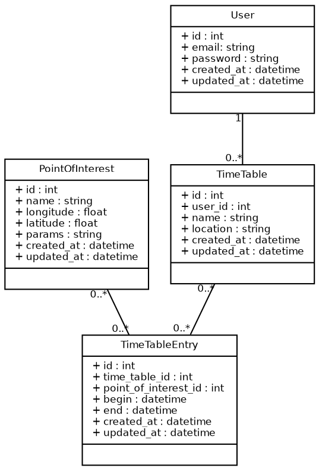

# Overview

- Class diagram

- Routes

- User scenarios

# Class diagram

# Routes - User

| Action                  | Example URI                |
|-------------------------|----------------------------|
| Login                   | POST /api/v1/user/login    |
| Logout                  | POST /api/v1/user/logout   |
| Register                | POST /api/v1/user/register |
| Get user information    | GET  /api/v1/user/[id]     |
| Update user information | PUT  /api/v1/user/[id]     |

# Routes - Travel plan

| Action                             | Example URI              |
|------------------------------------|--------------------------|
| Get travel plan based on location, | POST /api/v1/plan        |
| arrival and departure time         |                          |
| Save travel plan                   | POST /api/v1/plan/save   |
| Change travel plan                 | PUT /api/v1/plan/[id]    |
| Delete travel plan                 | DELETE /api/v1/plan/[id] |

# User scenarios 

- Initial travel planning    

- Change travel plan 

- 

# 

Thank you for your attention!

